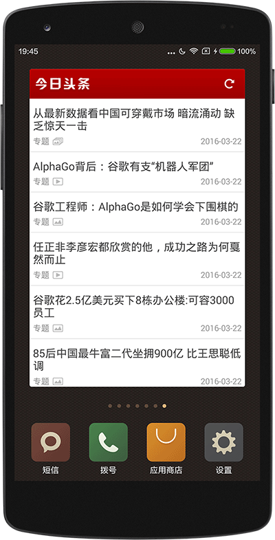

## Android AppWidget



### AppWidget Size
Using the google formula of (number of cells * 74) - 2 to calculate dp for your 1x1 widget would make the widget dimensions 72x72 dp.4x4 widget like this:
``` xml
<?xml version="1.0" encoding="utf-8"?>
<appwidget-provider xmlns:android="http://schemas.android.com/apk/res/android"
    android:initialLayout="@layout/layout_widget_news_list"
    android:minHeight="294dp"
    android:minResizeHeight="294dp"
    android:minResizeWidth="294dp"
    android:minWidth="294dp"
    android:previewImage="@drawable/widget_preview"
    android:resizeMode="vertical"
    android:updatePeriodMillis="86400000" >

</appwidget-provider>
```

### Refresh period
``` java
Intent autoRefreshIntent = new Intent(this, NewsAppWidgetProvider.class);
autoRefreshIntent.setAction(NewsAppWidgetProvider.ACTION_REFRESH_AUTO);
PendingIntent pending = PendingIntent.getBroadcast(NewsWidgetService.this, 0, autoRefreshIntent, 0);

// 1*60seconds
final long updateTime = 1 * 60 * 1000;
Time time = new Time();
long nowMillis = System.currentTimeMillis();
time.set(nowMillis + updateTime);
long updateTimes = time.toMillis(true);

AlarmManager alarm = (AlarmManager) getSystemService(Context.ALARM_SERVICE);
alarm.set(AlarmManager.RTC_WAKEUP, updateTimes, pending);
stopSelf();
```